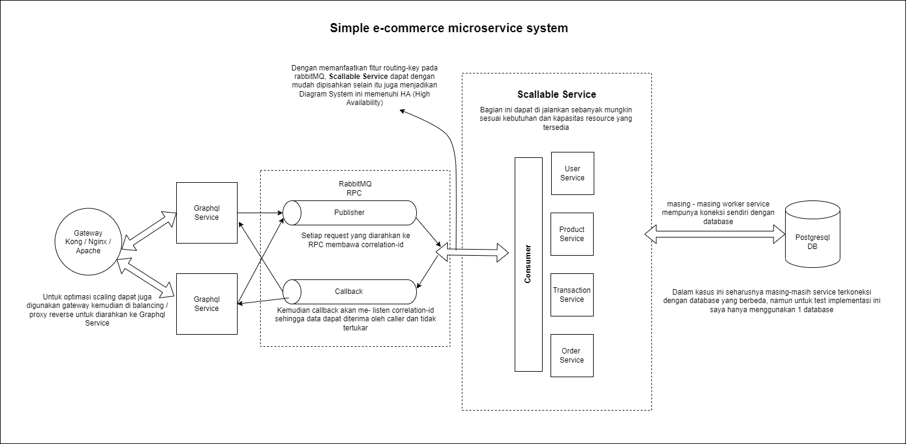

# Simple E-Commerce

## Diagram sistem



## Sekilas microservice

Pada test kali ini saya menggunakan 4 modul yaitu:
1. `user-service` : untuk mengatur login dan registernya.
2. `product-service` : untuk mengangani katalog produk.
3. `transaction-service` : untuk melakukan transaksi seperti tambah ke keranjang, tambah kuantitas / qty, buat tagihan, dan pembayaran.
4. `order-service` : untuk mengelola pesanan yang sudah terbayar.

Masing masing service mempunyai akses table sendiri sehingga tidak ada join query lintas service.

Sebagai catatan beriku masing-masing table yang ada:
- `user` : dikelola oleh `user-service`
- `product` : dikelola oleh `product-service`
- `transaction` : dikelola oleh `transaction-service`
- `transaction_cart` : dikelola oleh `transaction-service`
- `transaction_payment` : dikelola oleh `transaction-service`
- `order` : dikelola oleh `order-service`
- `order_item` : dikelola oleh `order-service`

Dengan demikian service dapat dipisahkan databasenya masing-masing, namun pada implementasi ini saya hanya menggunakan 1 database dengan 7 table diatas.

## Pelengkapan yang diperlukan
1. Docker yang mendukung perintah `docker-compose` serta support `docker-compose.yml` versi **3.5** keatas   
1. Golang `go` versi `1.17`


## Menjalankan server

Untuk menjalankan keseluruhan server cukup diperlukan perintah sebagai berikut:
```
$ docker-compose -f docker-compose-stack.yml up -d
$ docker-compose -f docker-compose-service.yml up -d --build
```
Script compose sengaja dipisah dikarenakan ada proses migrasi dalam `docker-compose-service.yml` tepatnya saat pembuatan image `simple_ecommerce_cli:1.0`. 

Sehingga service `postgresql` harus berjalan supaya proses migrasi dalam pembuatan image dapat berjalan dengan benar.

Parameter tambahan `--build` juga untuk memastikan proses migrasi database tereksekusi.

Contoh output yang diharapkan:

```
[wahyu@wahyu-server simple-e-commerce]$ sudo docker-compose -f docker-compose-stack.yml up -d
Creating network "simple_ecommerce_network" with driver "bridge"
Creating simple_ecommerce_rabbitmq ... done
Creating simple_ecommerce_rabbitmq ... 
[wahyu@wahyu-server simple-e-commerce]$ sudo docker-compose -f docker-compose-service.yml up -d --build
WARNING: Found orphan containers (simple_ecommerce_rabbitmq, simple_ecommerce_postgresql) for this project. If you removed or renamed this service in your compose file, you can run this command with the --remove-orphans flag to clean it up.
Building graphql
Step 1/19 : FROM python:alpine3.16 as db_migrator
 ---> 3d057565b53c
Step 2/19 : RUN apk add --no-cache postgresql-libs 
Removing intermediate container d0fa02c6e55c
Step 3/19 : RUN pip install alembic
Removing intermediate container ae98fdcffc32
 ---> f0154be5c37f
Step 4/19 : RUN pip install psycopg2
Removing intermediate container 8c4b4296c57f
Step 5/19 : RUN pip install python-dotenv
Removing intermediate container f2fe5d160af3
Step 6/19 : WORKDIR /migration/
Removing intermediate container 9b6e334f96b7
Step 7/19 : COPY alembic.ini migration.sh ./
 ---> fa9c070b86d9
Step 8/19 : COPY database ./database
 ---> 4a71ae98ecfe
Step 9/19 : RUN ./migration.sh
 ---> Running in af8fd3c2bdb6
INFO  [alembic.runtime.migration] Context impl PostgresqlImpl.
INFO  [alembic.runtime.migration] Will assume transactional DDL.
INFO  [alembic.runtime.migration] Running upgrade  -> 3c4b74d1a51a, init
Removing intermediate container af8fd3c2bdb6
 ---> 4a45fe5ff4dd

Step 10/19 : FROM golang:1.17-alpine as builder
 ---> 270c4f58750f
Step 11/19 : WORKDIR /app/
 ---> Running in 0c89272d6a56
Removing intermediate container 0c89272d6a56
 ---> b6a3e8920554
Step 12/19 : COPY . ./
 ---> 71a96c7daabf
Step 13/19 : RUN go mod tidy
Removing intermediate container 26c41f2d84bb
Step 14/19 : RUN go build -o cli
Removing intermediate container e1d5ab4c602b


Step 15/19 : FROM alpine:3.14
 ---> 5977be310a9d
Step 16/19 : WORKDIR /root/
 ---> Running in 27a45ba25ee8
Removing intermediate container 27a45ba25ee8
 ---> b6ab018e316d
Step 17/19 : COPY --from=builder /app/cli ./
 ---> 7c72cf824290
Step 18/19 : COPY .env.docker ./.env
 ---> fcf5f021da7a
Step 19/19 : CMD ["./cli"]
 ---> Running in d35a451d410f
Removing intermediate container d35a451d410f
 ---> dd1d41b0ea86

Successfully built dd1d41b0ea86
Creating simple_ecommerce_graphql ... done
Creating simple_ecommerce_user_service ... done
Creating simple_ecommerce_user_service ...
```

Apabila user anda tidak termasuk dalam group `docker`  pastikan tambahkan `sudo` didepannya.

Setelah itu kita bisa melakukan testing terhadap service kita yang sudah jalan.

## Melakukan pengetesan

Untuk melakukan pengetesan, perintah yang dapat dijalankan yaitu:
```
$ go test ./tests/ -v http://[docker host]:7000/graphql/
```

Contoh output yang diharapkan:
```
[wahyu@wahyu-server simple-e-commerce]$ go test ./tests/ -v http://localhost:7000/graphql/
=== RUN   TestUserMutation_CreateTestUser
--- PASS: TestUserMutation_CreateTestUser (0.05s)
=== RUN   TestUserMutation_Login
--- PASS: TestUserMutation_Login (0.02s)
=== RUN   TestUserMutation_Register
--- PASS: TestUserMutation_Register (0.02s)
=== RUN   TestUserQuery_User
--- PASS: TestUserQuery_User (0.04s)
PASS
ok      wahyuade.com/simple-e-commerce/tests    0.142s
```

## Dokumentasi API (Insomnia v4 JSON collection)

Untuk dokumentasi API dapat menggunakan
1. Insomnia dapat di download [disini](/insomnia.json).
1. Postman dapat di download [disini](/postman.json).